# How Pension Sahayak works

Pension Sahayak is a Next.js demo app that helps pensioners and families find their next step: guided checklists, a sample PPO lookup, a fictional service-centre directory, and grievances that are saved to MongoDB and can be tracked.

Live site: https://pension-sahayak.netlify.app

This guide follows one real example through each part of the system. Every request and response shown below was captured from the running app. The only exception is the grievance reference, whose value is random and so differs for each submission.

---

## 1. The big picture

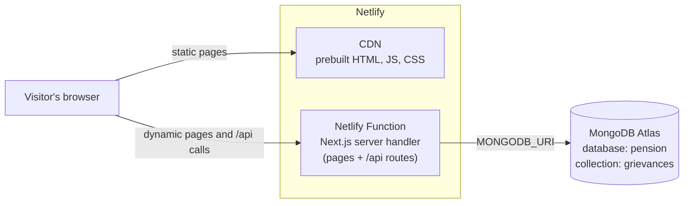

`[lang]` is `en`, `hi` or `te` (see section 12). Most pages are built once per language at deploy time and served from Netlify's CDN. Only the grievance page and the `/api` routes run server code, and only grievances touch the database.

| Route | How it is served | Uses the database? |
| --- | --- | --- |
| `/[lang]`, `/[lang]/about`, `/[lang]/pension-help`, `/[lang]/service-centre` | Static HTML per language, built at deploy time | No |
| `/[lang]/pension-help/[slug]` (5 topics) | Static HTML, one page per topic and language | No |
| `/[lang]/grievance` | Server-rendered per request (reads `?reference=`) | No (the page itself) |
| `GET /api/health` | Function | Yes (ping) |
| `POST /api/pension` | Function | No (mock record) |
| `GET /api/service-centres?q=` | Function | No (built-in list) |
| `POST /api/grievances` | Function | Yes (insert) |
| `GET /api/grievances/:reference` | Function | Yes (read) |

---

## 2. Site map and user journeys

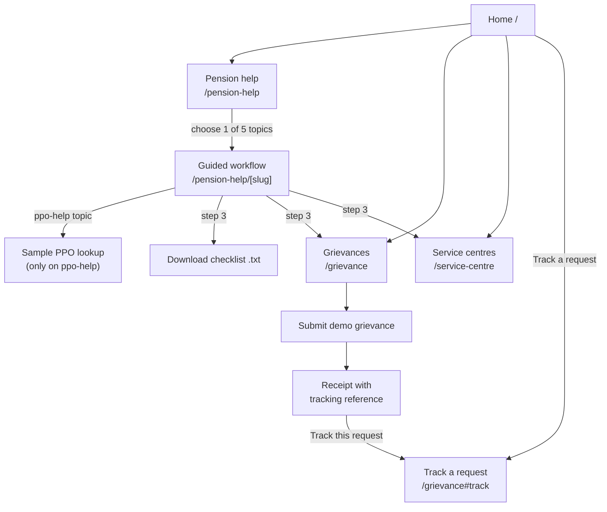

The five topics come from [src/lib/workflows.ts](src/lib/workflows.ts): `family-pension`, `pension-not-received`, `life-certificate`, `ppo-help`, `update-details`.

---

## 3. Example A: building a checklist (runs entirely in the browser)

**Scenario:** a Navy family whose pension has not started yet opens **Pension not received**.

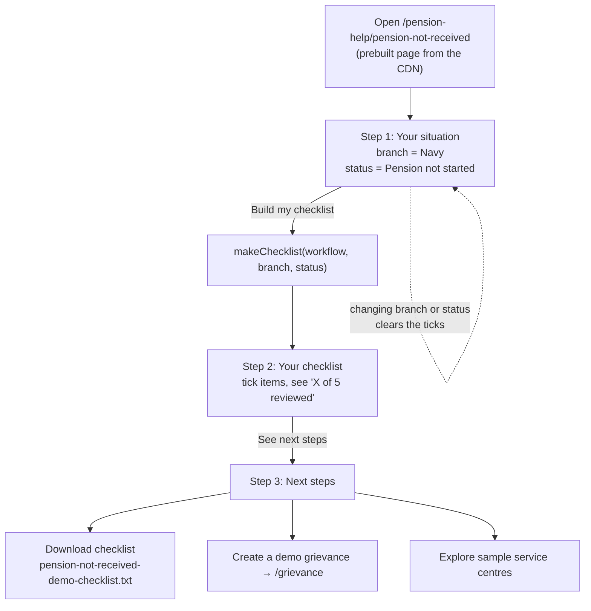

No request reaches the server: the checklist is computed in the browser from the workflow definition.

**How the checklist is built** ([src/lib/workflows.ts](src/lib/workflows.ts), `makeChecklist`):

1. The topic's documents
2. `"<branch> service reference (sample)"`
3. One extra item that depends on the pension status:

| Status | Extra item |
| --- | --- |
| Receiving pension | Sample recent pension credit reference |
| Pension not started | Sample sanction / application acknowledgement |
| Not sure | Any sample pension correspondence available |

**Real output for this example**, as the downloaded file (with the first two items ticked):

```text
PENSION SAHAYAK · DAD DAY DEMO
Pension not received
Navy · Pension not started
Illustrative checklist only. Confirm actual requirements with the authorised provider.

[x] Sample pension payment month
[x] Redacted sample bank statement
[ ] Demo PPO reference
[ ] Navy service reference (sample)
[ ] Sample sanction / application acknowledgement

Check the expected payment month and sample bank entry.
Check whether a life certificate acknowledgement is available.
Prepare a demo grievance with the payment month and issue.
```

---

## 4. Example B: sample PPO lookup

**Scenario:** on `/pension-help/ppo-help`, the visitor clicks **Look up sample record** with `DEMO-PPO-12345`.

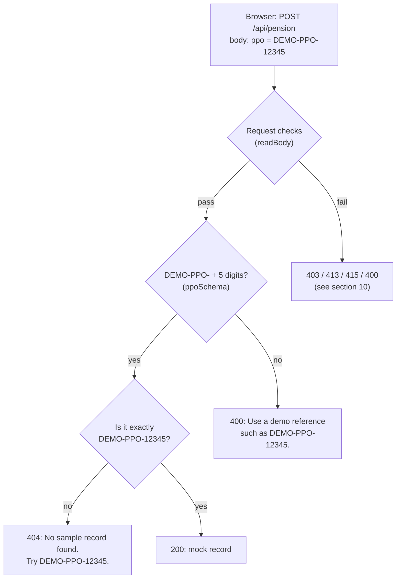

**Real responses:**

| Input | Status | Response |
| --- | --- | --- |
| `DEMO-PPO-12345` | 200 | `{"data":{"ppo":"DEMO-PPO-12345","name":"Sample Pensioner","branch":"army","status":"active","lifeCertificate":"acknowledged","demo":true}}` |
| `DEMO-PPO-99999` | 404 | `{"error":"No sample record found. Try DEMO-PPO-12345.","code":"ppo_not_found"}` |
| `1234` | 400 | `{"error":"Use a demo reference such as DEMO-PPO-12345.","code":"invalid_ppo"}` |

This is mock data: no government system is queried. `branch`, `status` and `lifeCertificate` are codes; the page shows them in the visitor's language (for example Telugu: "సైన్యం · సక్రియం · డెమో రికార్డు").

---

## 5. Example C: submitting a grievance (writes to MongoDB)

**Scenario:** a visitor reports a delayed payment on `/grievance`.

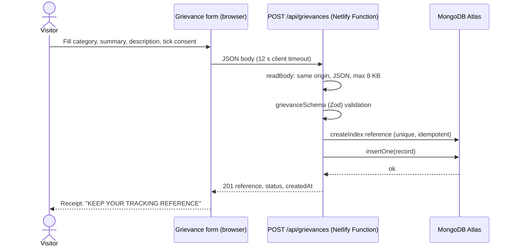

Every check the request has to pass, with the status code returned when it fails:

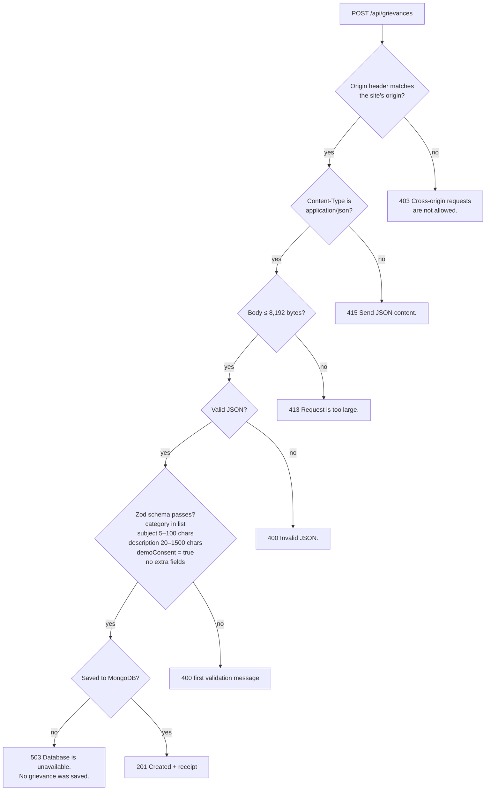

**Request the form sends:**

```json
{
  "category": "Payment",
  "subject": "Sample pension payment delayed",
  "description": "A fictional missed pension payment for this demo.",
  "demoConsent": true
}
```

**Document stored in `pension.grievances`** ([src/lib/server/grievances.ts](src/lib/server/grievances.ts)):

```json
{
  "category": "Payment",
  "subject": "Sample pension payment delayed",
  "description": "A fictional missed pension payment for this demo.",
  "demoConsent": true,
  "reference": "PS-9C1E4B7A2D8F4E6A9B3C5D7E1F2A4B6C",
  "status": "Received",
  "createdAt": "2026-09-28T19:05:00.000Z"
}
```

**Response to the browser** (the subject and description are never echoed back):

```json
{
  "data": {
    "reference": "PS-9C1E4B7A2D8F4E6A9B3C5D7E1F2A4B6C",
    "status": "Received",
    "createdAt": "2026-09-28T19:05:00.000Z",
    "demo": true
  }
}
```

The reference is `PS-` followed by a random UUID (128 random bits) in uppercase hex, so it can't be guessed. Anyone who has the reference can see its status, so treat it like a password. The example value above is illustrative; each submission gets its own.

**Real validation failure** (nothing is saved):

```text
POST /api/grievances  {"category":"Payment","subject":"Hi","description":"short","demoConsent":true}
→ 400 {"error":"Use at least 5 characters for the subject.","code":"invalid_subject"}
```

---

## 6. Example D: tracking a grievance

**Scenario:** the visitor clicks **Track this request** on the receipt.

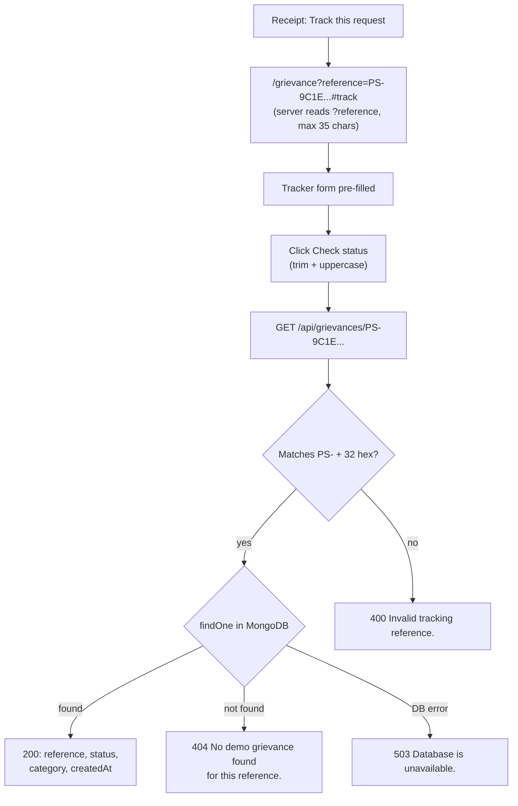

**Response** (the query returns only these four fields):

```json
{
  "data": {
    "reference": "PS-9C1E4B7A2D8F4E6A9B3C5D7E1F2A4B6C",
    "status": "Received",
    "createdAt": "2026-09-28T19:05:00.000Z",
    "category": "Payment"
  }
}
```

**Real responses for bad input:**

| Request | Status | Response |
| --- | --- | --- |
| `GET /api/grievances/abc` | 400 | `{"error":"Invalid tracking reference.","code":"invalid_reference"}` |
| `GET /api/grievances/PS-00000000000000000000000000000000` | 404 | `{"error":"No demo grievance found for this reference.","code":"grievance_not_found"}` |

The status always stays **Received**: there is no case-management layer or status-update endpoint in this demo.

---

## 7. Example E: service-centre search

**Scenario:** the visitor types a query on `/service-centre`.

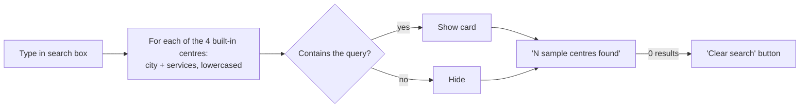

The page filters in the browser as you type, without any network request. On the Hindi and Telugu pages, English city and service names still match ("Pune" finds "पुणे डेमो सहायता डेस्क"). The same filter is also available at `/api/service-centres?q=` for API clients.

| Query | Results |
| --- | --- |
| `Pune` | Pune |
| `family pension` | New Delhi, Lucknow |
| `ppo` | New Delhi, Bengaluru |
| `life` | Pune, Lucknow |
| `Mumbai` | none → "Clear search" |

**Real API response for `?q=Pune`:**

```json
{"data":[{"id":"demo-pune","city":"Pune","name":"Pune demo assistance desk","address":"Illustrative location · Pune city","services":["Payment support","Life certificate"],"hours":"Sample hours: Mon–Fri, 10:00–16:00"}],"demo":true}
```

All locations are fictional ([src/lib/centres.ts](src/lib/centres.ts)).

---

## 8. How the database connection works

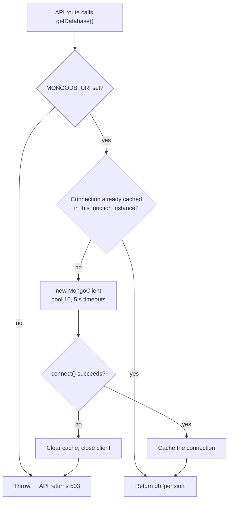

- The connection is cached on `globalThis`, so a warm Netlify Function reuses it instead of reconnecting on every request ([src/lib/server/db.ts](src/lib/server/db.ts)).
- If a connection attempt fails, the cache is cleared, so the next request tries again instead of reusing the failure.
- The database name comes from the URI path (`.../pension`). The `grievances` collection is created automatically by the first insert.

**Health check.** `GET /api/health` pings the database:

| Result | Status | Response |
| --- | --- | --- |
| Reachable (live site, 2026-09-28) | 200 | `{"app":"ok","database":"connected","mode":"demo"}` |
| Unreachable | 503 | `{"app":"ok","database":"unavailable","mode":"demo"}` |

---

## 9. From a code change to the live site (CI/CD)

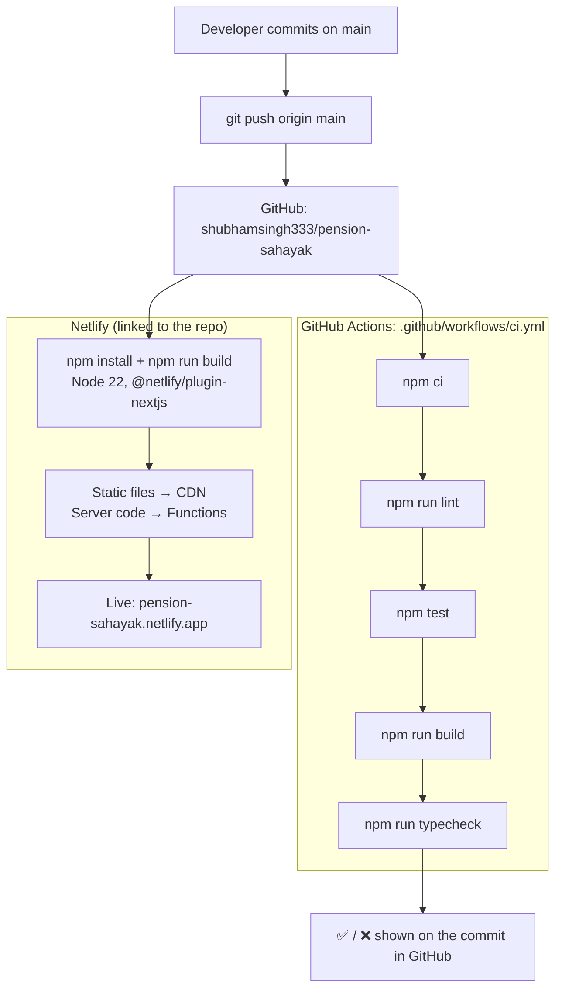

- **Push to `main`:** CI checks run and Netlify deploys to production, both at the same time.
- **Pull request:** CI checks run and Netlify builds a deploy preview with its own URL.
- **Build settings** come from [netlify.toml](netlify.toml). The only secret, `MONGODB_URI`, is set in the Netlify project's environment variables and is never committed.
- **Deploys aren't gated on CI:** Netlify doesn't wait for the GitHub checks, so a commit whose checks fail still deploys. The ❌ on the commit is your warning.

**Real example:** commit `dbbe930` ("Use Netlify Git integration for deploys; keep GitHub Actions for CI"), pushed on 2026-09-28:

| System | Result | Time |
| --- | --- | --- |
| GitHub Actions CI | success | 18:57:43 → 18:58:21 UTC (38 s) |
| Netlify production deploy | ready | 36 s build and deploy |

---

## 10. Error reference

All errors use the shape `{"error": "...", "code": "..."}`. `error` is an English message for API clients; the site translates `code` using the `errors` section of each dictionary. Successful data responses use `{"data": ...}`.

| Status | When | Message |
| --- | --- | --- |
| 400 | Bad JSON, failed validation, bad tracking reference | e.g. `Invalid JSON.`, `Use at least 5 characters for the subject.` |
| 403 | Request sent from another site's origin | `Cross-origin requests are not allowed.` |
| 404 | Unknown PPO or grievance reference | `No sample record found. Try DEMO-PPO-12345.` |
| 413 | Body larger than 8 KB | `Request is too large.` |
| 415 | Body not sent as JSON | `Send JSON content.` |
| 503 | Database unreachable or `MONGODB_URI` missing | `Database is unavailable. Please try again later. No grievance was saved.` |

Every response also carries these security headers from [next.config.ts](next.config.ts): `X-Content-Type-Options: nosniff`, `Referrer-Policy: strict-origin-when-cross-origin`, `X-Frame-Options: DENY`.

---

## 11. Where each piece lives

| Concern | File |
| --- | --- |
| Topics, documents, checklist rules | [src/lib/workflows.ts](src/lib/workflows.ts) |
| 3-step guided workflow UI | [src/components/pension/workflow.tsx](src/components/pension/workflow.tsx) |
| PPO lookup UI / API | [src/components/pension/ppo-lookup.tsx](src/components/pension/ppo-lookup.tsx), [src/app/api/pension/route.ts](src/app/api/pension/route.ts) |
| Grievance form and tracker UI | [src/components/grievance/grievance-form.tsx](src/components/grievance/grievance-form.tsx), [src/components/grievance/tracker.tsx](src/components/grievance/tracker.tsx) |
| Grievance APIs | [src/app/api/grievances/route.ts](src/app/api/grievances/route.ts), [src/app/api/grievances/[reference]/route.ts](src/app/api/grievances/[reference]/route.ts) |
| Validation rules (shared) | [src/lib/validation.ts](src/lib/validation.ts) |
| Request checks and error responses | [src/lib/server/http.ts](src/lib/server/http.ts) |
| Database connection | [src/lib/server/db.ts](src/lib/server/db.ts) |
| Grievance persistence | [src/lib/server/grievances.ts](src/lib/server/grievances.ts) |
| Service-centre data and search | [src/lib/centres.ts](src/lib/centres.ts), [src/components/centres/search.tsx](src/components/centres/search.tsx) |
| Browser → API helper (12 s timeout) | [src/lib/client-api.ts](src/lib/client-api.ts) |
| Languages, URL helpers, detection | [src/i18n/config.ts](src/i18n/config.ts), [src/proxy.ts](src/proxy.ts) |
| Translations (en is the source) | [src/i18n/messages/en.ts](src/i18n/messages/en.ts), [hi.ts](src/i18n/messages/hi.ts), [te.ts](src/i18n/messages/te.ts) |
| Loading translations | [src/i18n/server.ts](src/i18n/server.ts) (Server Components), [src/i18n/client.tsx](src/i18n/client.tsx) (Client Components) |
| Language switcher | [src/components/layout/language-switcher.tsx](src/components/layout/language-switcher.tsx) |
| API error codes | [src/lib/api-errors.ts](src/lib/api-errors.ts) |
| Deploy and CI config | [netlify.toml](netlify.toml), [.github/workflows/ci.yml](.github/workflows/ci.yml) |

---

## 12. Languages (English, Hindi, Telugu)

Every page exists in three languages under a URL prefix: `/en/…`, `/hi/…`, `/te/…`. Each version is built as static HTML, so switching language doesn't make pages any slower.

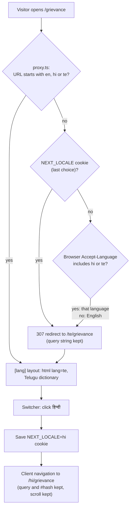

**Real example**, captured from the running app:

| Request | Result |
| --- | --- |
| `GET /` with `Accept-Language: hi-IN,hi;q=0.9` | 307 → `/hi` |
| `GET /` with cookie `NEXT_LOCALE=te` and `Accept-Language: hi` | 307 → `/te` (saved choice wins) |
| `GET /grievance?reference=PS-ABC` | 307 → `/en/grievance?reference=PS-ABC` |
| `GET /te/nope` | 404, "మిమ్మల్ని సరైన దారిలోకి తీసుకువద్దాం." |

**How translations reach each component:**

- **Server Components** call `getI18n()`. It reads the language from the URL with `next/root-params` and loads only that language's dictionary.
- **Client Components** call `useI18n()`. The layout sends the browser only the parts of the dictionary that interactive components need (forms, checklist, search, errors). Page copy stays on the server.
- **Links** use `<LocalizedLink href="/grievance">`, which adds the current language automatically.

**Adding or changing text:** edit [en.ts](src/i18n/messages/en.ts) first. TypeScript then reports every key missing from `hi.ts` and `te.ts`, and `npm test` checks that no translation is empty.
